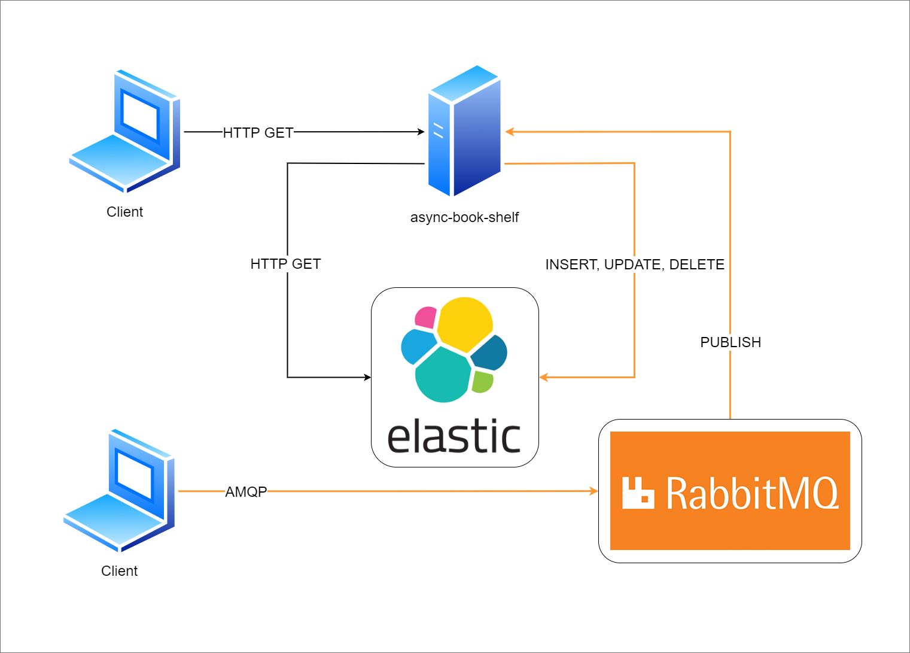

# Async Book Shelf

This project is a book tracker, with which you may register books that you wish to read and also those that you have already read. [RabbitMQ](https://www.rabbitmq.com/) and [ElasticSearch](https://www.elastic.co/elasticsearch/) are vital components of the solution.

## Architecture

This project runs a web server that handles HTTP requests (see [Routes](##Routes)) for retrieving book data from ElasticSearch, as well as listeners on AMQP (RabbitMQ) for writing data asynchronously (insertion, deletion and update).



## Routes

This project contains a single route that retrieves books from ElasticSearch:

```
GET /books
Query params: key, value
```

## Dependencies

### Packages

Download all project dependencies with the `go get` command.

### ElasticSearch

You must have access to an ElasticSearch server and create an index as defined below. Be sure to use the same index name as provided in the `.env` file (see [Usage](##Usage)).

```
PUT {elastic_search_address}:{port}/{index}

{
  "mappings": {
    "properties": {
      "id": {
        "type": "text"
      },
      "name": {
        "type": "text"
      },
      "author": {
        "type": "text"
      },
      "read": {
        "type": "boolean"
      }
    }
  }
}
```

### RabbitMQ

The only requirement is to provide access to a RabbitMQ server (see [Usage](##Usage)), as the project will generate the exchange and queues automatically.

## Usage

You should make a copy of the `.env-example` file, rename it as `.env` and provide the required info, as detailed below:

```
SERVER_PORT=                    # Port on which the REST API server will run

RABBITMQ_ADDRESS=               # Address of the RabbitMQ server
RABBITMQ_PORT=                  # Port of the RabbitMQ server
RABBITMQ_USER=                  # User of the RabbitMQ server
RABBITMQ_PASSWORD=              # Password of the RabbitMQ server
RABBITMQ_TIMEOUT=               # Connection timeout in seconds
RABBITMQ_EXCHANGE_NAME=         # Exchange name
RABBITMQ_EXCHANGE_TYPE=         # Exchange type (prefer 'topic')
RABBITMQ_INSERTION_ROUTING_KEY= # Key for routing messages to the Insertion queue
RABBITMQ_UPDATE_ROUTING_KEY=    # Key for routing messages to the Update queue
RABBITMQ_DELETION_ROUTING_KEY=  # Key for routing messages to the Deletion queue

ELASTICSEARCH_ADDRESS=          # Address of the ElasticSearch server
ELASTICSEARCH_PORT=             # Port of the ElasticSearch server
ELASTICSEARCH_USER=             # User of the ElasticSearch server
ELASTICSEARCH_PASSWORD=         # Password of the ElasticSearch server
ELASTICSEARCH_INDEX=            # Index name for storing books
```

## Compiling and running

You may compile the project by running `go build` from the root directory, which will generate a binary file called `async-book-shelf`.

It is also possible to invoke Go and run the project with `go run main.go`.

## Docker

  Async Book Shelf is capable of running on Docker. For doing so, you must have Docker installed in your system.
  Details on Docker installation can be found [here](https://docs.docker.com/get-docker/).
  
  This project contains a docker-compose definition with ElasticSearch and RabbitMQ integrations, which may be in your development environment with the following commands:
  
  ### Build 
  
  After installing Docker, build the image with the following command:
  
    $ docker-compose build
    
  ### Start
  
  After building the image, run Async Book Shelf with the following command:
  
    $ docker-compose start

  ### Stop

  For stopping Async Book Shelf, run the following command:

    $ docker-compose stop
    
  ### Build and Start
  
  It is also possible to build and start the project with a single command.
  The following command also attaches your terminal to the container and provides you with live log output:
  
    $ docker-compose up
